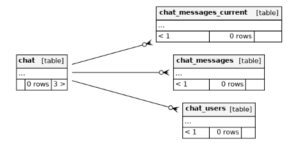

# Chat Dash

## Tables

List of Tables with their function described below:

### chat

Each of these is a chat room

#### Fields

- id
- chat_time
- course_id
- intro
- intro_format \* text format of intro field
- keep_days
- name
- schedule
- student_logs
- created_at
- updated_at

### chat_messages

Stores all the actual chat messages

#### Fields

- id
- chat_id
- group_id
- is_system
- message
- created_at
- updated_at
- user_id

### chat_messages_current

Stores current session

#### Fields

- id
- chat_id
- group_id
- is_system
- message
- created_at
- updated_at
- user_id

### chat_users

Keeps track of which users are in which chat rooms

#### Fields

- id
- chat_id
- course_id
- first_ping
- group_id
- ip
- lang
- last_message_ping
- last_ping
- sid
- version
- user_id
