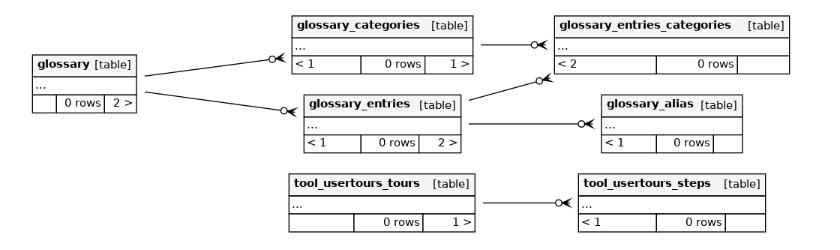

# Glossary Dash

## Tables

List of Tables with their function described below:

### Table: glossary **

The `glossary` table contains the structure and settings of glossaries within Moodle.

#### Fields

- **id**: `BIGINT(19)` (Primary Key), Unique identifier for the glossary.
- **allow_comments**: `TINYINT(3)`, Indicates whether comments are allowed (`0` = No, `1` = Yes).
- **allow_duplicated_entries**: `TINYINT(3)`, Indicates whether duplicate entries are allowed (`0` = No, `1` = Yes).
- **allow_print_view**: `TINYINT(3)`, Indicates whether the print view is allowed (`0` = No, `1` = Yes).
- **approval_display_format**: `VARCHAR(50)`, Display format when approving entries, default is 'default'.
- **assessed**: `BIGINT(19)`, Indicates whether the glossary is assessed.
- **assess_time_finish**: `BIGINT(19)`, The finish time for assessments.
- **assess_time_start**: `BIGINT(19)`, The start time for assessments.
- **completion_entries**: `INT(10)`, Number of entries required for completion.
- **course**: `BIGINT(19)`, The ID of the course the glossary belongs to.
- **default_approval**: `TINYINT(3)`, Default approval status for new entries (`0` = No, `1` = Yes).
- **display_format**: `VARCHAR(50)`, Display format of the glossary, default is 'dictionary'.
- **edit_always**: `TINYINT(3)`, Indicates whether entries can always be edited (`0` = No, `1` = Yes).
- **ent_by_page**: `SMALLINT(5)`, Number of entries per page, default is `10`.
- **global_glossary**: `TINYINT(3)`, Indicates whether the glossary is global (`0` = No, `1` = Yes).
- **intro**: `LONGTEXT`, Introduction text for the glossary.
- **intro_format**: `SMALLINT(5)`, Format of the introduction text.
- **main_glossary**: `TINYINT(3)`, Indicates whether it is the main glossary (`0` = No, `1` = Yes).
- **name**: `VARCHAR(255)`, Name of the glossary.
- **rss_articles**: `TINYINT(3)`, Number of RSS articles.
- **rss_type**: `TINYINT(3)`, Type of RSS feed.
- **scale**: `BIGINT(19)`, Scale used for grading.
- **show_all**: `TINYINT(3)`, Indicates whether all entries are shown (`0` = No, `1` = Yes).
- **show_alphabet**: `TINYINT(3)`, Indicates whether the alphabet is shown (`0` = No, `1` = Yes).
- **show_special**: `TINYINT(3)`, Indicates whether special characters are shown (`0` = No, `1` = Yes).
- **use_dyna_link**: `TINYINT(3)`, Indicates whether dynamic linking is used (`0` = No, `1` = Yes).
- **created_at**: `BIGINT(19)`, Time when the glossary was created.
- **updated_at**: `BIGINT(19)`, Time when the glossary was last modified.

---

### Table: glossary_alias **

The `glossary_alias` table stores alias entries for glossary entries.

#### Fields

- **id**: `BIGINT(19)` (Primary Key), Unique identifier for the alias.
- **alias**: `VARCHAR(255)`, Alias name for the glossary entry.
- **entry_id**: `BIGINT(19)`, The ID of the glossary entry.

---

### Table: glossary_categories **

The `glossary_categories` table stores categories for glossary entries.

#### Fields

- **id**: `BIGINT(19)` (Primary Key), Unique identifier for the category.
- **glossary_id**: `BIGINT(19)`, The ID of the glossary.
- **name**: `VARCHAR(255)`, Name of the category.
- **use_dyna_link**: `TINYINT(3)`, Indicates whether dynamic linking is used (`0` = No, `1` = Yes).

---

### Table: glossary_entries **

The `glossary_entries` table stores entries within glossaries.

#### Fields

- **id**: `BIGINT(19)` (Primary Key), Unique identifier for the glossary entry.
- **approved**: `TINYINT(3)`, Approval status of the entry (`0` = No, `1` = Yes).
- **attachment**: `VARCHAR(100)`, Attachment file name.
- **case_sensitive**: `TINYINT(3)`, Indicates whether the entry is case sensitive (`0` = No, `1` = Yes).
- **concept**: `VARCHAR(255)`, Concept of the glossary entry.
- **definition**: `LONGTEXT`, Definition of the glossary entry.
- **definition_format**: `TINYINT(3)`, Format of the definition.
- **definition_trust**: `TINYINT(3)`, Indicates whether the definition is trusted (`0` = No, `1` = Yes).
- **full_match**: `TINYINT(3)`, Indicates whether full match is required (`0` = No, `1` = Yes).
- **glossary_id**: `BIGINT(19)`, The ID of the glossary the entry belongs to.
- **source_glossary_id**: `BIGINT(19)`, The ID of the source glossary.
- **teacher_entry**: `TINYINT(3)`, Indicates whether it is a teacher entry (`0` = No, `1` = Yes).
- **use_dyna_link**: `TINYINT(3)`, Indicates whether dynamic linking is used (`0` = No, `1` = Yes).
- **created_at**: `BIGINT(19)`, Time when the entry was created.
- **updated_at**: `BIGINT(19)`, Time when the entry was last modified.
- **user_id**: `BIGINT(19)`, The ID of the user who created the entry.

---

### Table: glossary_entries_categories

The `glossary_entries_categories` table stores categories for each glossary entry.

#### Fields

- **id**: `BIGINT(19)` (Primary Key), Unique identifier for the record.
- **category_id**: `BIGINT(19)`, The ID of the category.
- **entry_id**: `BIGINT(19)`, The ID of the glossary entry.

---

### Table: glossary_formats

The `glossary_formats` table stores settings for the display formats of glossaries.

#### Fields

- **id**: `BIGINT(19)` (Primary Key), Unique identifier for the record.
- **default_hook**: `VARCHAR(50)`, Default hook.
- **default_mode**: `VARCHAR(50)`, Default mode.
- **name**: `VARCHAR(50)`, Name of the format.
- **pop_up_format_name**: `VARCHAR(50)`, Name of the popup format.
- **show_group**: `TINYINT(3)`, Indicates whether the group is shown (`0` = No, `1` = Yes).
- **show_tabs**: `VARCHAR(100)`, Indicates whether tabs are shown (`0` = No, `1` = Yes).
- **sort_key**: `VARCHAR(50)`, Key used for sorting.
- **visible**: `TINYINT(3)`, Indicates whether the format is visible (`0` = No, `1` = Yes).
- **sort_order**: `VARCHAR(50)`, Order used for sorting.
