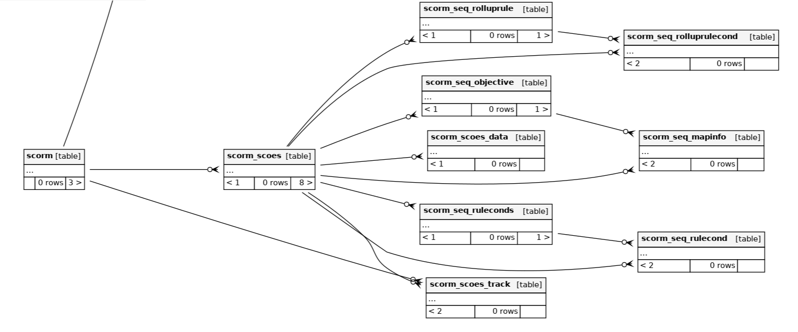

# SCORM Dash

## Tables

List of Tables with their function described below:

### Table: scorms

Each record is one SCORM module and its configuration.

#### Fields

- **id**: `BIGINT(19)` (Primary Key), Unique identifier for the record.
- **auto**: `BOOLEAN(1)`, Indicates if the SCORM module should start automatically.
- **auto_commit**: `BOOLEAN(1)`, Indicates if auto-commit is enabled.
- **completion_score_required**: `BIGINT(19)`, Score required for completion.
- **completion_status_all_scos**: `BOOLEAN(1)`, Indicates if completion status is required for all SCOs.
- **completion_status_required**: `BOOLEAN(1)`, Indicates if a specific completion status is required.
- **course_id**: `BIGINT(19)`, Foreign key to the course ID.
- **display_attempt_status**: `BOOLEAN(1)`, Indicates if the attempt status should be displayed.
- **display_course_structure**: `BOOLEAN(1)`, Indicates if the course structure should be displayed.
- **force_completed**: `BOOLEAN(1)`, Indicates if force complete is enabled.
- **force_new_attempt**: `BOOLEAN(1)`, Indicates if a new attempt is forced.
- **grade_method**: `TINYINT(3)`, Method used for grading.
- **height**: `BIGINT(19)`, Height of the SCORM package display.
- **hide_browse**: `BOOLEAN(1)`, Indicates if browsing is hidden.
- **hide_toc**: `BOOLEAN(1)`, Indicates if the table of contents is hidden.
- **intro**: `LONGTEXT(2147483647)`, Introduction text.
- **intro_format**: `SMALLINT(5)`, Format of the introduction text.
- **last_attempt_lock**: `BOOLEAN(1)`, Indicates if the last attempt is locked.
- **launch**: `BIGINT(19)`, Launch setting for the SCORM package.
- **mastery_override**: `BOOLEAN(1)`, Indicates if mastery override is enabled.
- **max_attempt**: `BIGINT(19)`, Maximum number of attempts allowed.
- **max_grade**: `DOUBLE(22)`, Maximum grade for the SCORM module.
- **md5_hash**: `VARCHAR(32)`, MD5 hash of the package file.
- **name**: `VARCHAR(255)`, Name of the SCORM module.
- **nav**: `BOOLEAN(1)`, Indicates if navigation is enabled.
- **nav_position_left**: `BIGINT(19)`, Left position for navigation.
- **nav_position_top**: `BIGINT(19)`, Top position for navigation.
- **options**: `VARCHAR(255)`, Additional options for the SCORM module.
- **popup**: `BOOLEAN(1)`, Indicates if the SCORM module should be displayed in a popup.
- **reference**: `VARCHAR(255)`, Reference for the SCORM module.
- **revision**: `BIGINT(19)`, Revision number of the SCORM module.
- **scorm_type**: `VARCHAR(50)`, Type of SCORM package (local, external, or repository).
- **sha1_hash**: `VARCHAR(40)`, SHA-1 hash of the package content or external path.
- **skip_view**: `BOOLEAN(1)`, Indicates if the view should be skipped.
- **time_close**: `BIGINT(19)`, Time when the SCORM module closes.
- **time_open**: `BIGINT(19)`, Time when the SCORM module opens.
- **update_freq**: `BOOLEAN(1)`, Indicates if the package must be automatically updated.
- **version**: `VARCHAR(9)`, Version of the SCORM package.
- **what_grade**: `BIGINT(19)`, Indicates what grade is used.
- **width**: `BIGINT(19)`, Width of the SCORM package display.
- **created_at**: `BIGINT(19)`, creation time.
- **updated_at**: `BIGINT(19)`, Last modified time.

---

### Table: scorm_aicc_sessions

Used by AICC HACP to store session information.

#### Fields

- **id**: `BIGINT(19)` (Primary Key), Unique identifier for the record.
- **attempt**: `BIGINT(19)`, Attempt number.
- **hacp_session**: `VARCHAR(255)`, Session ID used to authenticate AICC HACP communication.
- **lesson_status**: `VARCHAR(255)`, Status of the lesson.
- **sco_id**: `BIGINT(19)`, Foreign key to the `scorm_scoes` table.
- **scorm_id**: `BIGINT(19)`, Foreign key to the `scorm` table.
- **scorm_mode**: `VARCHAR(50)`, Mode of the SCORM module.
- **scorm_status**: `VARCHAR(255)`, Status of the SCORM module.
- **session_time**: `VARCHAR(255)`, Duration of the session.
- **created_at**: `BIGINT(19)`, Time when the session was created.
- **updated_at**: `BIGINT(19)`, Time when the session was last modified.
- **user_id**: `BIGINT(19)`, Foreign key to the user ID.

---

### Table: scorm_scoes

Each SCO part of the SCORM module.

#### Fields

- **id**: `BIGINT(19)` (Primary Key), Unique identifier for the record.
- **identifier**: `VARCHAR(255)`, Identifier for the SCO.
- **launch**: `LONGTEXT(2147483647)`, Launch data for the SCO.
- **manifest**: `VARCHAR(255)`, Manifest identifier for the SCO.
- **organization**: `VARCHAR(255)`, Organization identifier for the SCO.
- **parent**: `VARCHAR(255)`, Parent identifier for the SCO.
- **scorm**: `BIGINT(19)`, Foreign key to the SCORM module.
- **scorm_type**: `VARCHAR(5)`, Type of SCORM.
- **sort_order**: `BIGINT(19)`, Order of the SCOs.
- **title**: `VARCHAR(255)`, Title of the SCO.

---

### Table: scorm_scoes_datas

Contains variable data from packages.

#### Fields

- **id**: `BIGINT(19)` (Primary Key), Unique identifier for the record.
- **name**: `VARCHAR(255)`, Name of the data.
- **sco_id**: `BIGINT(19)`, Foreign key to the `scorm_scoes` table.
- **value**: `LONGTEXT(2147483647)`, Value of the data.

---

### Table: scorm_scoes_tracks

Tracks SCOs.

#### Fields

- **id**: `BIGINT(19)` (Primary Key), Unique identifier for the record.
- **attempt**: `BIGINT(19)`, Attempt number.
- **element**: `VARCHAR(255)`, Element being tracked.
- **sco_id**: `BIGINT(19)`, Foreign key to the `scorm_scoes` table.
- **scorm_id**: `BIGINT(19)`, Foreign key to the SCORM module.
- **value**: `LONGTEXT(2147483647)`, Value being tracked.
- **created_at**: `BIGINT(19)`, Time when the record was created.
- **updated_at**: `BIGINT(19)`, Time when the record was last modified.
- **user_id**: `BIGINT(19)`, Foreign key to the user ID.

---

### Table: scorm_seq_mapinfos

SCORM2004 objective mapinfo description.

#### Fields

- **id**: `BIGINT(19)` (Primary Key), Unique identifier for the record.
- **objective_id**: `BIGINT(19)`, Foreign key to the objective ID.
- **read_normalized_measure**: `BOOLEAN(1)`, Indicates if the normalized measure should be read.
- **read_satisfied_status**: `BOOLEAN(1)`, Indicates if the satisfied status should be read.
- **sco_id**: `BIGINT(19)`, Foreign key to the `scorm_scoes` table.
- **target_objective_id**: `BIGINT(19)`, Foreign key to the target objective ID.
- **write_normalized_measure**: `BOOLEAN(1)`, Indicates if the normalized measure should be written.
- **write_satisfied_status**: `BOOLEAN(1)`, Indicates if the satisfied status should be written.

---

### Table: scorm_seq_objectives

SCORM2004 objective description.

#### Fields

- **id**: `BIGINT(19)` (Primary Key), Unique identifier for the record.
- **min_normalized_measure**: `FLOAT(11)`, Minimum normalized measure.
- **objective_id**: `VARCHAR(255)`, Objective identifier.
- **primary_obj**: `BOOLEAN(1)`, Indicates if this is the primary objective.
- **satisfied_by_measure**: `BOOLEAN(1)`, Indicates if the objective is satisfied by measure.
- **sco_id**: `BIGINT(19)`, Foreign key to the `scorm_scoes` table.

---

### Table: scorm_seq_rollup_rules

SCORM2004 sequencing rule.

#### Fields

- **id**: `BIGINT(19)` (Primary Key), Unique identifier for the record.
- **action**: `VARCHAR(15)`, Action taken by the rule.
- **child_activity_set**: `VARCHAR(15)`, Set of child activities affected by the rule.
- **condition_combination**: `VARCHAR(3)`, Combination of conditions (e.g., "all").
- **minimum_count**: `BIGINT(19)`, Minimum count for the rule.
- **minimum_percent**: `FLOAT(11)`, Minimum percentage for the rule.
- **sco_id**: `BIGINT(19)`, Foreign key to the `scorm_scoes` table.

---

### Table: scorm_seq_rollup_rule_conds

SCORM2004 sequencing rule condition.

#### Fields

- **id**: `BIGINT(19)` (Primary Key), Unique identifier for the record.
- **cond**: `VARCHAR(25)`, Condition for the rule.
- **operator**: `VARCHAR(5)`, Operator for the condition (e.g., "noOp").
- **rollup_rule_id**: `BIGINT(19)`, Foreign key to the rollup rule ID.
- **sco_id**: `BIGINT(19)`, Foreign key to the `scorm_scoes` table.

---

### Table: scorm_seq_rule_conditions

SCORM2004 rule condition.

#### Fields

- **id**: `BIGINT(19)` (Primary Key), Unique identifier for the record.
- **cond**: `VARCHAR(30)`, Condition for the rule (e.g., "always").
- **measure_threshold**: `FLOAT(11)`, Measure threshold for the rule.
- **operator**: `VARCHAR(5)`, Operator for the condition (e.g., "noOp").
- **refrenced_objective**: `VARCHAR(255)`, Referenced objective.
- **rule_conditions_id**: `BIGINT(19)`, Foreign key to the rule conditions ID.
- **sco_id**: `BIGINT(19)`, Foreign key to the `scorm_scoes` table.

---

### Table: scorm_seq_rule_conds

SCORM2004 rule conditions.

#### Fields

- **id**: `BIGINT(19)` (Primary Key), Unique identifier for the record.
- **action**: `VARCHAR(25)`, Action taken by the rule.
- **condition_combination**: `VARCHAR(3)`, Combination of conditions (e.g., "all").
- **ruletype**: `TINYINT(3)`, Type of the rule.
- **scoid**: `BIGINT(19)`, Foreign key to the `scorm_scoes` table.
